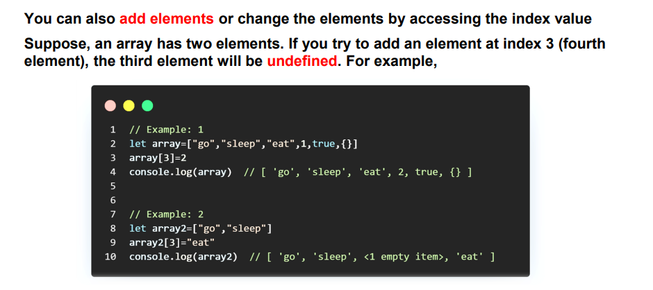

# What is Array in JavaScript ?

## An array in JavaScript is a type of global object that is used to store data. Arrays consist of an ordered collection or list containing zero or more data types, and use numbered indices starting from 0 to access specific items.

# Metod Array

## Metod pop

## Metod shift

## Metod push

## Metod unshift

## Metod toString 

## Metod splice

## Metod map

## Metod slice and cocncat

## Metod Find

## Metod forEach

## Metod indexOf and includes

