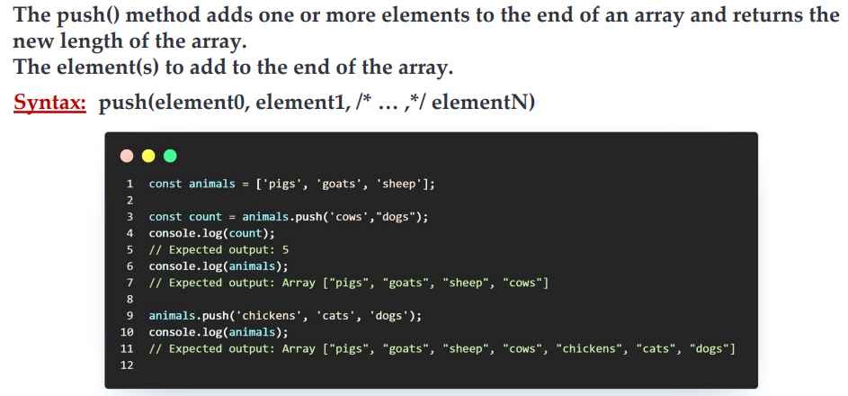

# What is Array in JavaScript ?

## An array in JavaScript is a type of global object that is used to store data. Arrays consist of an ordered collection or list containing zero or more data types, and use numbered indices starting from 0 to access specific items.

# Metod Array

## Metod pop

## Metod shift

## Metod push

## Metod unshift

## Metod toString 

## Metod splice

## Metod map

## Metod slice and cocncat

## Metod Find

## Metod forEach

## Metod indexOf and includes

# Method Destructuring

## The destructuring assignment syntax is a JavaScript expression that makes itpossible to unpack values from arrays, or properties from objects, into distinct variables.

# Method spread

## The spread (...) syntax allows an iterable, such as an array or string, to beexpanded in places where zero or more arguments (for function calls) orelements (for array literals) are expected. In an object literal, the spread syntax enumerates the properties of an object and adds the key-value pairs to the object being created.

# Method rest
## The rest parameter syntax allows a function to accept an indefinite number of arguments as an array.

